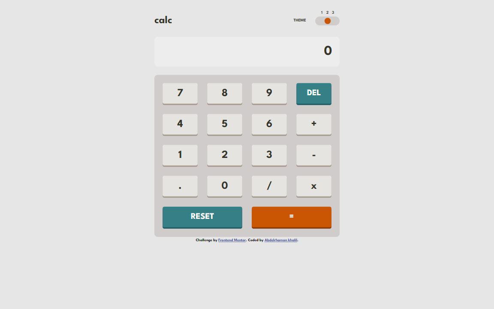
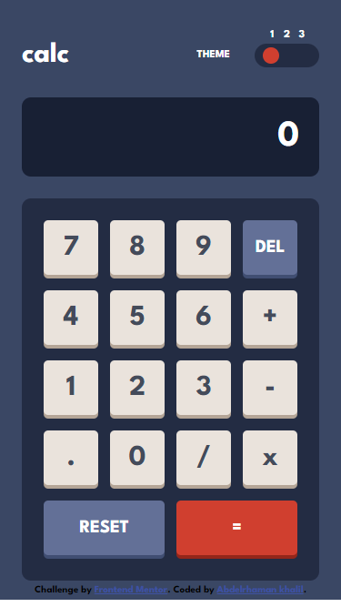

# Frontend Mentor - Calculator app solution

This is a solution to the [Calculator app challenge on Frontend Mentor](https://www.frontendmentor.io/challenges/calculator-app-9lteq5N29). Frontend Mentor challenges help you improve your coding skills by building realistic projects.

## Table of contents

- [Overview](#overview)
  - [The challenge](#the-challenge)
  - [Screenshot](#screenshot)
  - [Links](#links)
- [My process](#my-process)
  - [Built with](#built-with)
  - [What I learned](#what-i-learned)
- [Author](#author)
- [Acknowledgments](#acknowledgments)

**Note: Delete this note and update the table of contents based on what sections you keep.**

## Overview

### The challenge

Users should be able to:

- See the size of the elements adjust based on their device's screen size
- Perform mathmatical operations like addition, subtraction, multiplication, and division
- Adjust the color theme based on their preference
- Have their initial theme preference checked using `prefers-color-scheme` and have any additional changes saved in the browser

### Screenshot




### Links

- Solution URL: [solution URL](https://github.com/abdelrhmanKh/calculator-app-main)
- Live Site URL: [live site URL](https://abdelrhmankh.github.io/calculator-app-main/)

## My process

### Built with

- Semantic HTML5 markup
- CSS custom properties
- Flexbox
- CSS Grid
- Mobile-first workflow

### What I learned

How To switch between Themes

```js
arr.forEach((e, i) => {
  e.addEventListener("click", () => {
    e.style.opacity = "1";
    if (i == 0) {
      Object.entries(theme1).forEach((v) =>
        rootClass.style.setProperty(v[0], v[1])
      );
      localStorage.setItem("theme", `theme1`);
    } else if (i == 1) {
      Object.entries(theme2).forEach((v) =>
        rootClass.style.setProperty(v[0], v[1])
      );
      localStorage.setItem("theme", `theme2`);
    } else {
      Object.entries(theme3).forEach((v) =>
        rootClass.style.setProperty(v[0], v[1])
      );
      localStorage.setItem("theme", `theme3`);
    }

    arr
      .filter(function (item) {
        return item != e;
      })
      .forEach((item) => {
        item.style.opacity = "0";
      });
  });
});
```

### Continued development

Use this section to outline areas that you want to continue focusing on in future projects. These could be concepts you're still not completely comfortable with or techniques you found useful that you want to refine and perfect.

## Author

- Website - [AbdelRahman Khalil](https://abdelrhmankh.github.io/abdelrhmankhalil/)
- Frontend Mentor - [@abdelrhmanKh](https://www.frontendmentor.io/profile/abdelrhmanKh)
- LinkedIn - [@Abdelrhman-khalil](https://www.linkedin.com/in/abdelrhman-khalil-ali-9716a0188/)
